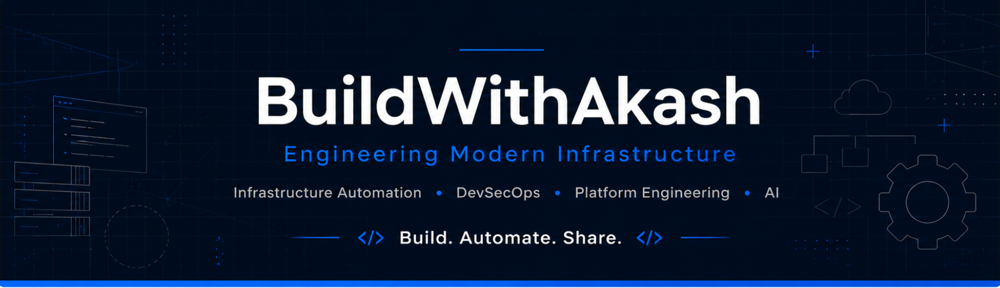

  

# 👋 Hi, I'm Akash Khurana

## 🚀 BuildWithAkash

Welcome to **BuildWithAkash** — my personal engineering lab where I build, experiment, document, and share practical solutions for modern infrastructure.

I'm passionate about Infrastructure Automation, DevSecOps, Compliance, Platform Engineering, and Artificial Intelligence. This GitHub is where I document my learning journey, publish projects, contribute to open source, and continuously improve as an engineer.

> **Build. Automate. Share.**

---

# 🧭 Engineering Focus

- 🏗️ Infrastructure Automation
- 🔐 DevSecOps
- 🛡️ Compliance as Code
- ☁️ Platform Engineering
- 🤖 AI for Operations (AIOps)
- 🌍 Open Source

---

# 💻 Technologies

### Infrastructure Automation

- Chef Infra
- Chef InSpec
- PowerShell
- Bash
- Python

### Operating Systems

- Linux
- Windows

### DevOps & Platform Engineering

- Git
- GitHub
- Jenkins

---

# 🌱 Currently Exploring

- Kubernetes
- Terraform
- AI Agents
- Retrieval-Augmented Generation (RAG)
- Cloud Native Technologies
- Open Source Contribution

---

# 🎯 Mission

To build practical engineering solutions that simplify infrastructure management, improve security, automate operations, and contribute meaningful projects to the engineering community.

---

# 📂 What You'll Find Here

This GitHub serves as my engineering workspace where I share:

- 🚀 Infrastructure Automation Projects
- 🔐 DevSecOps Labs
- 🛡️ Compliance as Code
- ☁️ Platform Engineering Experiments
- 🤖 AI & AIOps Projects
- 📚 Learning Notes
- 🌍 Open Source Contributions

Every repository represents something I've built, explored, or learned.

---

# 🚀 Current Goals

- Build production-quality automation projects
- Contribute consistently to open-source communities
- Learn Kubernetes and Platform Engineering
- Explore AI for Infrastructure & Operations
- Share knowledge through **BuildWithAkash**

---

# 🤝 Let's Connect

If you're interested in Infrastructure Automation, DevSecOps, Platform Engineering, AI, or Open Source, feel free to explore my repositories and connect with me.

---

### **Build. Automate. Share.**

*Engineering modern infrastructure, one project at a time.*

